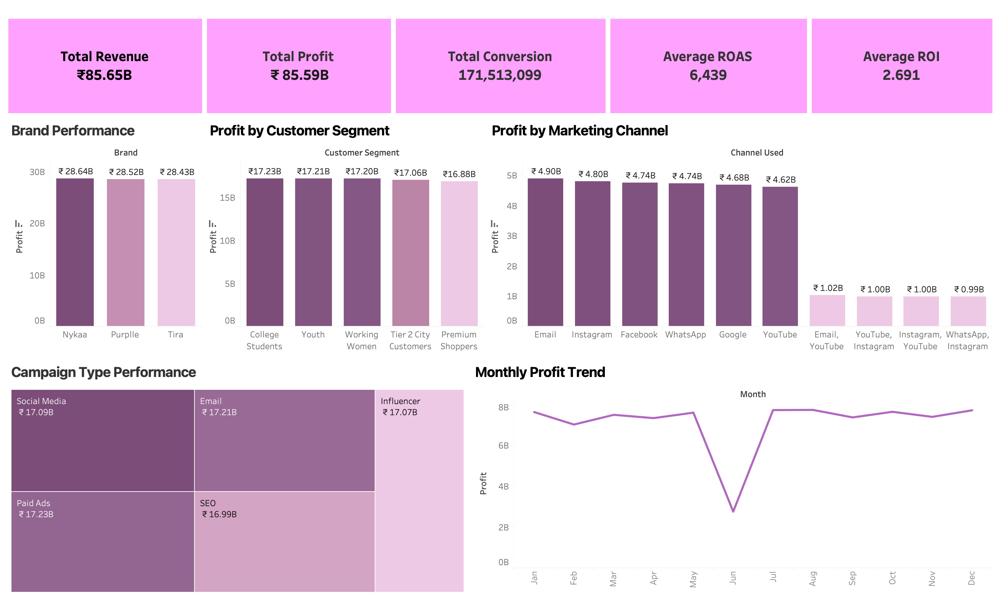
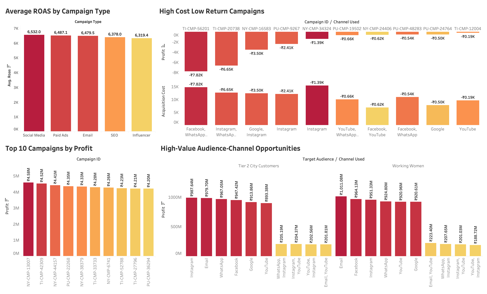

# 📊 Marketing Campaign Performance Analysis

> An end-to-end analytics project examining campaign performance across three beauty retail brands — uncovering profitability drivers, channel effectiveness, and high-value audience opportunities across 166,000+ campaign records.


---

## 📌 Project Snapshot

| Metric | Value |
|----------|---------|
| Records Analyzed | 166,665 |
| Brands | 3 |
| Timeframe | Jan–Dec 2025 |
| Dashboards | 2 |
| Tools Used | Excel, MySQL, Tableau |
| Project Type | Marketing Analytics |

> **Note:** This project uses a synthetic dataset created for analytical and educational purposes. The objective is to demonstrate end-to-end data analytics, business intelligence, and dashboarding skills.

---

## 🔍 Project Overview

This project performs a comprehensive analysis of digital marketing campaign data for three Indian beauty retail brands — Nykaa, Purplle, and Tira.

The objective of this project was to evaluate marketing effectiveness across channels, customer segments, and brands to identify revenue drivers, optimize budget allocation, and improve campaign profitability.

The analysis covers the complete analytics workflow:

- Data Cleaning & Validation
- Feature Engineering
- SQL-Based Business Analysis
- KPI Development
- Interactive Dashboard Creation
- Business Recommendation Generation

---

## 🎯 Business Objective

To evaluate marketing campaign effectiveness across brands, customer segments, and channels — and deliver actionable insights to improve:

- Revenue Growth
- Campaign Profitability
- Return on Investment (ROI)
- Customer Acquisition Efficiency
- Conversion Performance
- Marketing Budget Allocation

---

## 🛠️ Tools & Tech Stack

| Layer | Tool | Purpose |
|---|---|---|
| Data Cleaning | Microsoft Excel | Standardization, deduplication, feature engineering |
| Data Analysis | MySQL | KPI calculation, segmentation, performance ranking |
| Data Visualization | Tableau | Interactive dashboards, trend analysis, opportunity mapping |

---

## 📁 Dataset

| Property | Details |
|---|---|
| Sources | Raw campaign exports from Nykaa, Purplle, and Tira |
| Records | 166,665 campaign-level rows |
| Brands | Nykaa, Purplle, Tira |
| Timeframe | January – December 2025 |
| Channels | Email, Instagram, Facebook, WhatsApp, Google, YouTube |
| Campaign Types | Social Media, Paid Ads, Email, SEO, Influencer |
| Customer Segments | College Students, Youth, Working Women, Tier 2 City Customers, Premium Shoppers |

### Engineered Features

- CTR %
- CPA
- ROAS
- Profit
- Month
- Year
- Brand

---

### Data Documentation

To maintain a lightweight repository and comply with GitHub file-size limitations, the full working Excel workbook used during development is not included.

Instead, the repository provides:

- A cleaned CSV dataset
- An Excel documentation workbook containing:
  - Data Dictionary
  - Data Cleaning Log

These resources fully document the preparation and structure of the dataset used throughout the analysis.

---

## 🔄 Project Workflow

```text
Raw Data (3 CSVs)
        │
        ▼
Excel Cleaning & Feature Engineering
        │
        ▼
MySQL Business Analysis
        │
        ▼
Tableau Dashboard Development
        │
        ▼
Business Insights & Recommendations
```

---

## ❓ Key Business Questions

1. What is the overall performance of the marketing campaigns?
2. Which marketing channels generate the highest revenue, ROI, and profit?
3. Which campaign types perform best in conversions and ROAS?
4. Which customer segments are the most valuable?
5. Which brands achieve the strongest campaign performance?
6. How does campaign performance change over time?
7. Which campaigns have high acquisition cost but low returns?
8. What are the top-performing campaigns by revenue, profit, and conversions?
9. Which target audiences respond best to different marketing channels?
10. Which campaigns generated revenue higher than the overall average?

---

## 📈 Key Findings & Insights

### 🏆 Overall Performance

| Metric | Value |
|---|---|
| Total Revenue | ₹85.65B |
| Total Profit | ₹85.59B |
| Total Conversions | 171.5M |
| Average ROAS | 6,439 |
| Average ROI | 2.69 |
| Total Impressions | 9.18B |
| Total Clicks | 780.4M |

### 📡 Channel Insights

- Email generated the highest profitability.
- Instagram and Facebook were among the strongest acquisition channels.
- Audience-channel fit proved more important than channel selection alone.

### 👥 Customer Insights

- College Students represented the highest-value customer segment.
- Youth and Working Women closely followed in profitability.
- Segment profitability remained highly balanced, indicating multiple growth opportunities.

### ⚠️ Optimization Opportunities

- Several campaigns showed negative profitability.
- High acquisition costs and low conversion rates were the primary drivers of underperformance.
- Budget reallocation could significantly improve overall campaign efficiency.

---

## 💡 Business Recommendations

### Short-Term

- Pause identified loss-making campaigns.
- Reallocate budget toward high-performing campaigns.
- Reduce spend on low-performing audience-channel combinations.

### Medium-Term

- Build segment-specific campaign strategies.
- Expand successful audience-channel combinations.
- Conduct controlled A/B testing across marketing channels.

### Long-Term

- Develop predictive campaign scoring models.
- Implement automated marketing monitoring dashboards.
- Establish performance-based budget allocation frameworks.

---

## 📊 Dashboard Previews

### Campaign Performance Overview



### Marketing Optimization & Action Insights



---

## 📂 Repository Structure

```text
marketing-campaign-performance-analysis/
│
└── Marketing_Campaign_Performance_Analysis/
    │
    ├── data/
    │   ├── raw_nykaa_campaign_data.csv
    │   ├── raw_purplle_campaign_data.csv
    │   ├── raw_tira_campaign_data.csv
    │   └── marketing_Campaign_Performance_Cleaned.csv
    │
    ├── excel/
    │   └── marketing_Campaign_Performance.xlsx
    │
    ├── sql/
    │   └── Campaign_performance.sql
    │
    ├── tableau/
    │   └── marketing_Campaign_Performance_Analysis.twbx
    │
    ├── images/
    │   ├── marketing_campaign_performance_overview.png
    │   └── marketing_optimisation_action_insights.png
    │
    ├── presentation/
    │   └── marketing-Campaign-Performance-Analysis.pdf
    │
    └── README.md
```

---

## 🚀 How to Use This Project

### 1. Explore the Raw Data

Review the CSV files inside the data directory.

### 2. Review Data Cleaning

- Data Dictionary — column definitions, business meanings, and calculated field explanations
- Data Cleaning Log — cleaning steps, transformations, validation checks, and feature engineering process

These worksheets document the complete data preparation workflow used before analysis.
### 3. Run SQL Analysis

Import the cleaned dataset into MySQL and execute the SQL scripts.

### 4. Open Tableau Dashboard

Open the Tableau workbook to interact with dashboards and filters.

### 5. Review Presentation

Open the project presentation for a complete business summary.

---

## 📬 Contact

Email: adityapandey12391@gmail.com

---

## ✅ Skills Demonstrated

- Data cleaning and preprocessing
- Exploratory data analysis
- SQL querying and KPI calculation
- Customer churn analysis
- Revenue-loss analysis
- Customer segmentation
- Dashboard design in Tableau
- Business insight generation
- Data storytelling
- Portfolio project documentation


⭐ If you found this project useful, consider starring the repository.

Built with Excel • MySQL • Tableau
