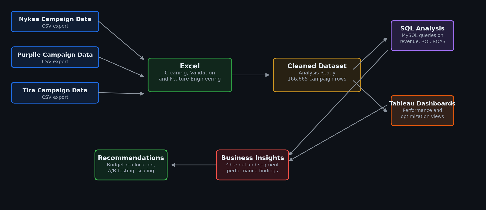
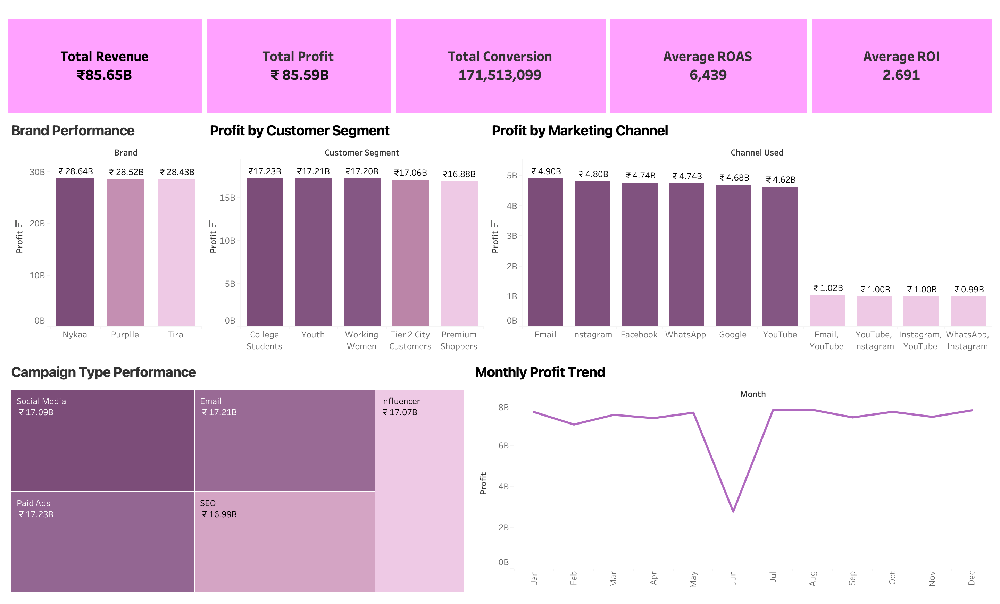
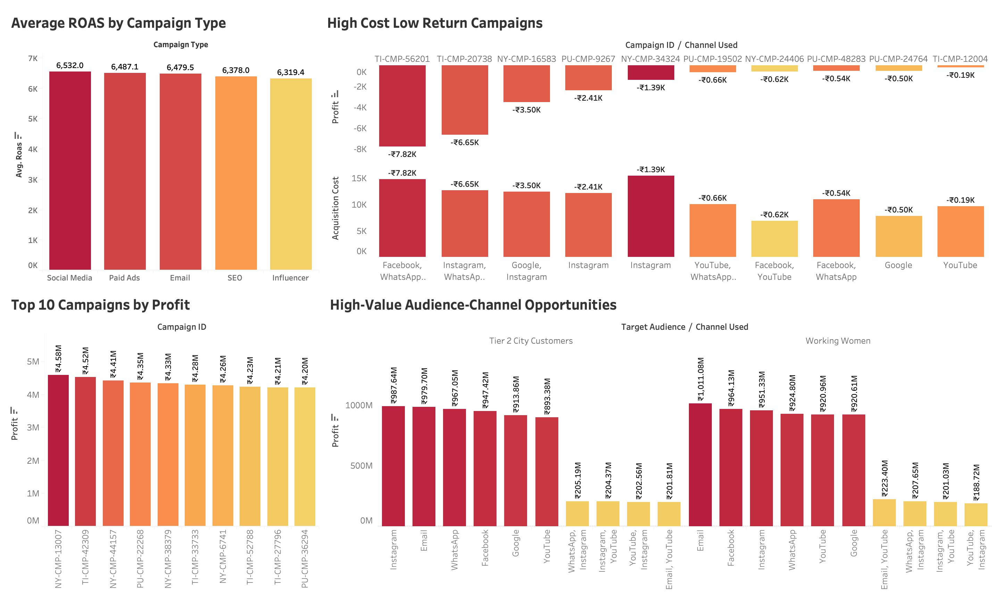

<div align="center">

# 📊 Marketing Campaign Performance & Budget Optimisation Analysis

### End-to-End Marketing Analytics Project | Excel · SQL · Tableau

*Analyzing 166,000+ campaign records across three beauty retail brands to optimize marketing spend, improve campaign profitability, and identify high-value customer acquisition opportunities.*

[](#)
[](#)
[](#)
[](LICENSE)

[Overview](#-project-overview) •
[Key Findings](#-key-findings--insights) •
[Dashboards](#-dashboard-previews) •
[Recommendations](#-business-recommendations) •
[How to Use](#-how-to-use-this-project)

</div>

---

## 🔍 Project Overview

This project performs a comprehensive analysis of digital marketing campaign data for three Indian beauty retail brands — **Nykaa**, **Purplle**, and **Tira**.

The objective is to evaluate marketing effectiveness across channels, customer segments, and brands to identify revenue drivers, optimize budget allocation, and improve campaign profitability.

The analysis covers the complete analytics workflow:

- 🧹 Data Cleaning & Validation
- ⚙️ Feature Engineering
- 🗄️ SQL-Based Business Analysis
- 📊 KPI Development
- 📈 Interactive Dashboard Creation
- 💡 Business Recommendation Generation

> 💡 **Why this project matters:** Every insight here is tied to a budget decision — which campaigns to pause, which channels to scale, and which audience-channel combinations are worth doubling down on.

---

## 📌 Project Snapshot

<div align="center">

| Metric | Value |
|---|---|
| 🧾 Records Analyzed | **166,665** |
| 🏷️ Brands | **3** (Nykaa, Purplle, Tira) |
| 📅 Timeframe | **Jan – Dec 2025** |
| 📊 Dashboards | **2** |
| 🛠️ Tools Used | Excel, MySQL, Tableau |
| 🗂️ Project Type | Marketing Analytics & Business Intelligence |

</div>

> ℹ️ **Note:** This project uses a synthetic dataset created for analytical and educational purposes, demonstrating end-to-end data analytics, business intelligence, and dashboarding skills.

---

## 🎯 Business Objective

To evaluate marketing campaign effectiveness across brands, customer segments, and channels — and deliver actionable insights to improve:

- 💰 Revenue Growth
- 📈 Campaign Profitability
- 🔁 Return on Investment (ROI)
- 🎯 Customer Acquisition Efficiency
- ✅ Conversion Performance
- 🧮 Marketing Budget Allocation

---

## 🛠️ Tools & Tech Stack

<div align="center">

| Layer | Tool | Purpose |
|---|---|---|
| **Data Cleaning** | Microsoft Excel | Standardization, deduplication, feature engineering |
| **Data Analysis** | MySQL | KPI calculation, segmentation, performance ranking |
| **Data Visualization** | Tableau | Interactive dashboards, trend analysis, opportunity mapping |

</div>

---

## 📁 Dataset

<div align="center">

| Property | Details |
|---|---|
| **Sources** | Raw campaign exports from Nykaa, Purplle, and Tira |
| **Records** | 166,665 campaign-level rows |
| **Brands** | Nykaa, Purplle, Tira |
| **Timeframe** | January – December 2025 |
| **Channels** | Email, Instagram, Facebook, WhatsApp, Google, YouTube |
| **Campaign Types** | Social Media, Paid Ads, Email, SEO, Influencer |
| **Customer Segments** | College Students, Youth, Working Women, Tier 2 City Customers, Premium Shoppers |

</div>

### Engineered Features

`CTR %` `CPA` `ROAS` `Profit` `Month` `Year` `Brand`

### 📝 Data Documentation

To keep the repository lightweight and within GitHub's file-size limits, the full working Excel workbook used during development is not included.

Instead, the repository provides:

- A cleaned CSV dataset
- An Excel documentation workbook containing:
  - **Data Dictionary** — column definitions, business meanings, and calculated field explanations
  - **Data Cleaning Log** — cleaning steps, transformations, validation checks, and feature engineering process

These resources fully document the preparation and structure of the dataset used throughout the analysis.

---

## 🔄 Project Workflow

<p align="center">
  
</p>

### 1️⃣ Data Cleaning — *Excel*

- Standardized and deduplicated raw campaign exports from all three brands
- Engineered key metrics: CTR %, CPA, ROAS, Profit, Month, Year, Brand
- Validated data against the documented Data Dictionary and Cleaning Log
- Exported the cleaned dataset for SQL and Tableau

### 2️⃣ SQL Analysis — *MySQL*

Queried the cleaned dataset to evaluate:

- Revenue, profit, and ROI by channel, campaign type, and brand
- Customer segment value and profitability
- Campaign performance trends over time
- High-acquisition-cost, low-return campaigns
- Top-performing campaigns by revenue, profit, and conversions

### 3️⃣ Dashboard Design — *Tableau*

Built two focused dashboards covering overall performance and optimization opportunities (see below).

---

## ❓ Key Business Questions

1. What is the overall performance of the marketing campaigns?
2. Which marketing channels generate the highest revenue, ROI, and profit?
3. Which campaign types perform best in conversions and ROAS?
4. Which customer segments are the most valuable?
5. Which brands achieve the strongest campaign performance?
6. How does campaign performance change over time?
7. Which campaigns have high acquisition cost but low returns?
8. What are the top-performing campaigns by revenue, profit, and conversions?
9. Which target audiences respond best to different marketing channels?
10. Which campaigns generated revenue higher than the overall average?

---

## 📈 Key Findings & Insights

### 🏆 Overall Performance

<div align="center">

| Metric | Value |
|---|---|
| 💵 Total Revenue | **₹85.65B** |
| 📈 Total Profit | **₹85.59B** |
| ✅ Total Conversions | **171.5M** |
| 📊 Average ROAS | **6,439** |
| 🔁 Average ROI | **2.69** |
| 👁️ Total Impressions | **9.18B** |
| 🖱️ Total Clicks | **780.4M** |

</div>

### 📡 Channel Insights

- 📧 Email generated the highest profitability.
- 📸 Instagram and Facebook were among the strongest acquisition channels.
- 🎯 Audience-channel fit proved more important than channel selection alone.

### 👥 Customer Insights

- 🎓 College Students represented the highest-value customer segment.
- 👩‍💼 Youth and Working Women closely followed in profitability.
- ⚖️ Segment profitability remained highly balanced, indicating multiple growth opportunities.

### ⚠️ Optimization Opportunities

- 📉 Several campaigns showed negative profitability.
- 💸 High acquisition costs and low conversion rates were the primary drivers of underperformance.
- 🔧 Budget reallocation could significantly improve overall campaign efficiency.

---

## 💡 Business Recommendations

<table>
<tr><td valign="top" width="33%">

**🟢 Short-Term**
- Pause identified loss-making campaigns
- Reallocate budget toward high-performing campaigns
- Reduce spend on low-performing audience-channel combinations

</td><td valign="top" width="33%">

**🟡 Medium-Term**
- Build segment-specific campaign strategies
- Expand successful audience-channel combinations
- Conduct controlled A/B testing across marketing channels

</td><td valign="top" width="33%">

**🔵 Long-Term**
- Develop predictive campaign scoring models
- Implement automated marketing monitoring dashboards
- Establish performance-based budget allocation frameworks

</td></tr>
</table>

---

## 📊 Dashboard Previews

### 1️⃣ Campaign Performance Overview

A high-level view of marketing campaign performance across brands, channels, and campaign types — highlighting revenue, profit, conversions, ROAS, ROI, and monthly performance trends.

<p align="center">
  
</p>

### 2️⃣ Marketing Optimization & Action Insights

Focused on campaign optimization opportunities — identifying high-performing campaigns, loss-making campaigns, audience-channel fit, and areas for strategic budget reallocation.

<p align="center">
  
</p>

> 🖱️ **Want to explore interactively?** Open `tableau/marketing_Campaign_Performance_Analysis.twbx` in Tableau Desktop (or Tableau Public) to filter by brand, channel, and segment yourself.

---

## 📑 Project Presentation

A stakeholder-ready presentation summarizing the complete analysis, methodology, key findings, dashboard insights, and business recommendations.

📄 [View Presentation: Marketing Campaign Performance Analysis](presentation/marketing-Campaign-Performance-Analysis.pdf)

---

## 📂 Repository Structure

```text
marketing-campaign-performance-analysis/
│
├── data/
│   ├── raw_nykaa_campaign_data.csv
│   ├── raw_purplle_campaign_data.csv
│   ├── raw_tira_campaign_data.csv
│   └── marketing_Campaign_Performance_Cleaned.csv
│
├── excel/
│   └── marketing_Campaign_Performance.xlsx
│
├── sql/
│   └── Campaign_performance.sql
│
├── tableau/
│   └── marketing_Campaign_Performance_Analysis.twbx
│
├── images/
│   ├── marketing_workflow.png
│   ├── marketing_Campaign_Performance_Overview.png
│   └── marketing_Optimization___Action_Insights.png
│
├── presentation/
│   └── marketing-Campaign-Performance-Analysis.pdf
│
├── README.md
└── LICENSE
```

---

## 🚀 How to Use This Project

**1. Explore the raw data**

Review the CSV files inside the `data/` directory.

**2. Review data cleaning**

- **Data Dictionary** — column definitions, business meanings, and calculated field explanations
- **Data Cleaning Log** — cleaning steps, transformations, validation checks, and feature engineering process

These worksheets document the complete data preparation workflow used before analysis.

**3. Run the SQL analysis**

Import the cleaned dataset into MySQL and execute the SQL scripts in `sql/Campaign_performance.sql`.

**4. Open the Tableau dashboard**

```text
tableau/marketing_Campaign_Performance_Analysis.twbx
```

**5. Review the presentation**

Open the project presentation for a complete business summary.

---

## 🧠 Skills Demonstrated

- 🧹 Data Cleaning & Validation
- ⚙️ Feature Engineering
- 🗄️ SQL Business Analysis
- 📊 KPI Development
- 📈 Tableau Dashboard Design
- 🎯 Marketing & Channel Performance Analysis
- 💬 Business Insight Communication
- 🎨 Data Visualization & Storytelling

---

## 📬 Contact

**Aditya Pandey**
📧 adityapandey12391@gmail.com

<div align="center">

[](https://github.com/aditya-pandey-data)

</div>

---

⭐ If you found this project useful, consider starring the repository.

*Built with Excel • MySQL • Tableau*

---

## 📜 License

This project is licensed under the terms of the [MIT License](LICENSE).
